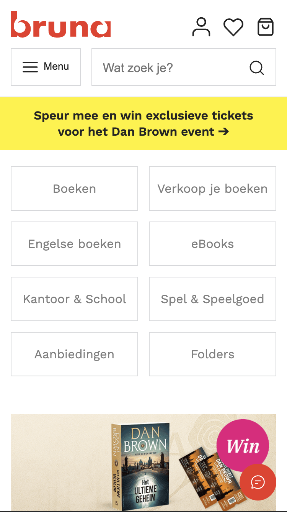
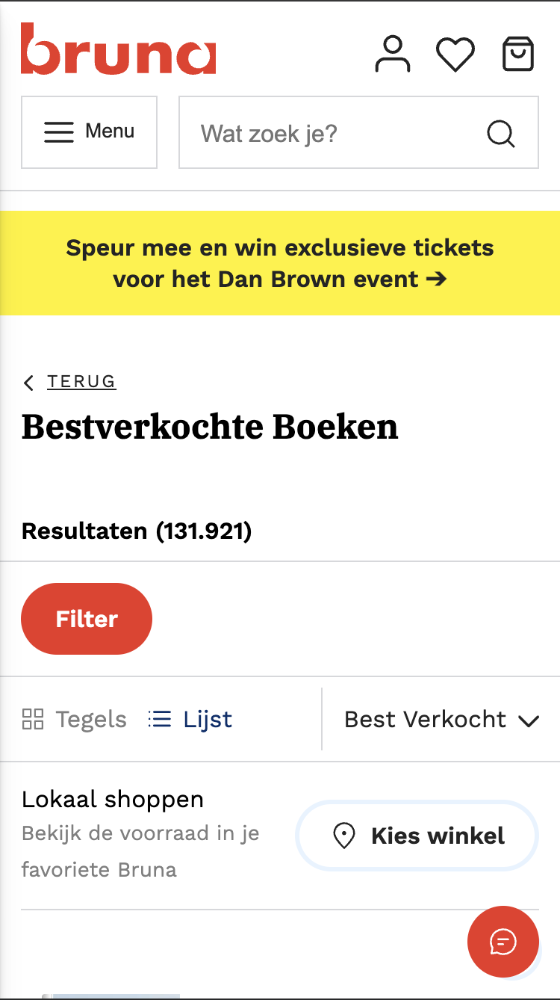

# Procesverslag
Markdown is een simpele manier om HTML te schrijven.  
Markdown cheat cheet: [Hulp bij het schrijven van Markdown](https://github.com/adam-p/markdown-here/wiki/Markdown-Cheatsheet).

Nb. De standaardstructuur en de spartaanse opmaak van de README.md zijn helemaal prima. Het gaat om de inhoud van je procesverslag. Besteedt de tijd voor pracht en praal aan je website.

Nb. Door *open* toe te voegen aan een *details* element kun je deze standaard open zetten. Fijn om dat steeds voor de relevante stuk(ken) te doen.

## Jij

  
Ik ben van plan om de 'Bruna' website te maken bij FED.

  ### Auteur:
  Ryan Scheers

  #### Je startniveau:
  Blauw

  #### Je focus:
  Mijn focus is 'Responsive' design.
 

## Je website

  
Ik ga de 'Bruna' site namaken.

  ### Je opdracht:
  link: https://www.bruna.nl/alle/boeken 
  Dit is de home pagina van de website.

  link: https://www.bruna.nl/bestverkocht/boeken
  Deze pagina laat de populairste boeken zien.

  #### Screenshot(s) van de eerste pagina (small screen): 
  Home pagina 
  

  #### Screenshot(s) van de tweede pagina (small screen):
  Populaire boeken.
  
 

## Toegankelijkheidstest 1/2 (week 1)

  
Tijdens de les hebben de toegankelijkheid gestest van onze gekozen website. Tijdens het test van mijn Bruna site ben ik achter mogelijke verbeterpunten gekomen.

  ### Bevindingen
  Lijst met je bevindingen die in de test naar voren kwamen:

  1. De bedragen van boeken worden niet voorgelezen. Als je een screenreader gebruikt kom je er niet achter hoe duur een boek is. 

  2. Veel afbeeldingen worden niet uitgelegd. Zo staan er onder sommige boeken uitgebeeld met afbeeldingen van sterren wat mensen er van vinden. De screenreader leest dit niet voor.

  3. Er staan ook geen € euro tekens in de screenreader. Ik weet niet of dit niet werkt in de screenreader of dat de Bruna vergeten is om dit er in te verwerken.

  4. De titel van een boek worden heel vaak genoemd. Je hoort soms wel 3 keer de titel van een boeken. Ik denk dat 2 keer genoeg moet zijn.

  Verder is de Bruna site goed te navigeren met de screenreader. Bijna alles heeft een alt tekst en de tekst is goed te begrijpen.

## Breakdownschets (week 1)

  
Ik heb mijn breakdownschets in Figma gemaakt. Ik heb aan de linkerkant van de screenshot met kleuren de header, main en footer van elkaar onderscheden. Verder heb ik m.b.v. inspecteren gekeken hoe de Bruna site is opgebouwd en zo heb ik gekeken hoe ik de site zelf wil opbouwen

  ### de hele pagina: 
  

  ### dynamisch deel (bijv menu): 
  

  ### wellicht nog een dynamisch deel (bijv filter): 
  

## Voortgang 1 (week 2)

  
uitwerken voor 1e voortgang

  ### Stand van zaken
  hier dit ging goed & dit was lastig (neem ook screenshots op van delen van je website en code)

  ### Agenda voor meeting
  samen met je groepje opstellen

  | student 1      | student 2          | student 3    | student 4        |
  | ---            | ---                | ---          | ---              |
  | dit bespreken  | en dit             | en ik dit    | en dan ik dat    |
  | en dat ook nog | dit als er tijd is | nog een punt | dit wil ik zeker |
  | ...            | ...                | ...          | ...              |

  ### Verslag van meeting
  hier na afloop snel de uitkomsten van de meeting vastleggen

  - punt 1
  - punt 2
  - nog een punt
  - ...

## Voortgang 2 (week 3)

  
uitwerken voor 2e voortgang

  ### Stand van zaken
  hier dit ging goed & dit was lastig (neem ook screenshots op van delen van je website en code)

  ### Agenda voor meeting
  samen met je groepje opstellen

  | student 1      | student 2          | student 3    | student 4        |
  | ---            | ---                | ---          | ---              |
  | dit bespreken  | en dit             | en ik dit    | en dan ik dat    |
  | en dat ook nog | dit als er tijd is | nog een punt | dit wil ik zeker |
  | ...            | ...                | ...          | ...              |

  ### Verslag van meeting
  hier na afloop snel de uitkomsten van de meeting vastleggen

  - punt 1
  - punt 2
  - nog een punt
- ...

## Toegankelijkheidstest 2/2 (week 4)

  
uitwerken na test in 9e werkgroep

  ### Bevindingen
  Lijst met je bevindingen die in de test naar voren kwamen (geef ook aan wat er verbeterd is):

## Voortgang 3 (week 4)

  
uitwerken voor 3e voortgang

  ### Stand van zaken
  hier dit ging goed & dit was lastig (neem ook screenshots op van delen van je website en code)

  ### Agenda voor meeting
  samen met je groepje opstellen

  | student 1      | student 2          | student 3    | student 4        |
  | ---            | ---                | ---          | ---              |
  | dit bespreken  | en dit             | en ik dit    | en dan ik dat    |
  | en dat ook nog | dit als er tijd is | nog een punt | dit wil ik zeker |
  | ...            | ...                | ...          | ...              |

  ### Verslag van meeting
  hier na afloop snel de uitkomsten van de meeting vastleggen

  - punt 1
  - punt 2
  - nog een punt
  - ...

## Eindgesprek (week 5)

  
uitwerken voor eindgesprek

  ### Je uitkomst - karakteristiek screenshots:
  

  ### Dit ging goed/Heb ik geleerd: 
  Korte omschrijving met plaatjes

  

  ### Dit was lastig/Is niet gelukt:
  Korte omschrijving met plaatjes

  

## Bronnenlijst

  
continu bijhouden terwijl je werkt

  Nb. Wees specifiek ('css-tricks' als bron is bijv. niet specifiek genoeg). 
  Nb. ChatGpT en andere AI horen er ook bij.
  Nb. Vermeld de bronnen ook in je code.

  1. bron 1
  2. bron 2
  3. ...

