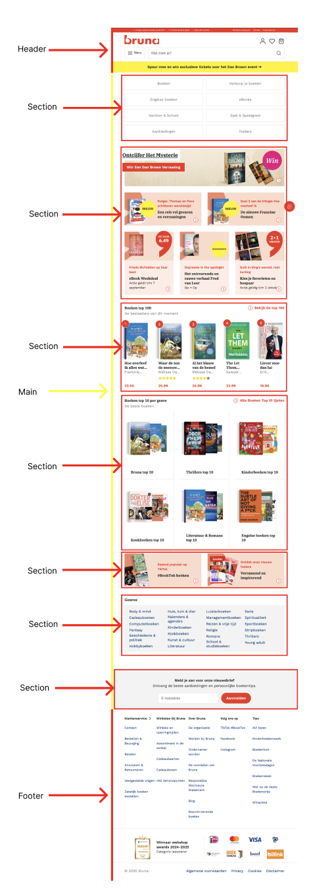
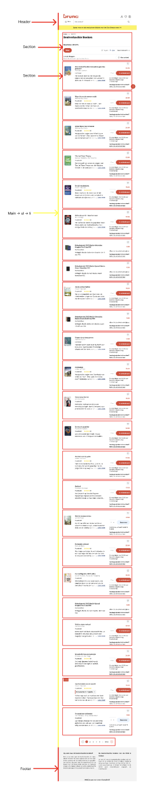
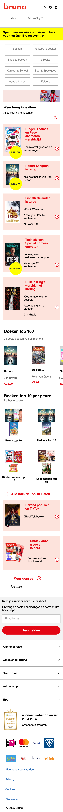

# Procesverslag
Markdown is een simpele manier om HTML te schrijven.  
Markdown cheat cheet: [Hulp bij het schrijven van Markdown](https://github.com/adam-p/markdown-here/wiki/Markdown-Cheatsheet).

Nb. De standaardstructuur en de spartaanse opmaak van de README.md zijn helemaal prima. Het gaat om de inhoud van je procesverslag. Besteedt de tijd voor pracht en praal aan je website.

Nb. Door *open* toe te voegen aan een *details* element kun je deze standaard open zetten. Fijn om dat steeds voor de relevante stuk(ken) te doen.

## Jij

  
Ik ben van plan om de 'Bruna' website te maken bij FED.

  ### Auteur:
  Ryan Scheers

  #### Je startniveau:
  Blauw

  #### Je focus:
  Mijn focus is 'Responsive' design.
 

## Je website

  
Ik ga de 'Bruna' site namaken.

  ### Je opdracht:
  link: https://www.bruna.nl/alle/boeken 
  Dit is de home pagina van de website.

  link: https://www.bruna.nl/kantoor/notitieboek-pl-a5-leer-782249 
  Dit is een product pagina

  #### Screenshot(s) van de eerste pagina (small screen): 
  Home pagina 
  

  #### Screenshot(s) van de tweede pagina (small screen):
  Notitieboek PL A5 Leer
 

## Toegankelijkheidstest 1/2 (week 1)

  
Tijdens de les hebben de toegankelijkheid gestest van onze gekozen website. Tijdens het test van mijn Bruna site ben ikachter mogelijke verbeterpunten gekomen.

  ### Bevindingen
  Lijst met je bevindingen die in de test naar voren kwamen:

  1. De bedragen van boeken worden niet voorgelezen. Als je een screenreader gebruikt kom je er niet achter hoe duur een boek is. 

  2. Veel afbeeldingen worden niet uitgelegd. Zo staan er onder sommige boeken uitgebeeld met afbeeldingen van sterren wat mensen er van vinden. De screenreader leest dit niet voor.

  3. Er staan ook geen € euro tekens in de screenreader. Ik weet niet of dit niet werkt in de screenreader of dat de Bruna vergeten is om dit er in te verwerken.

  4. De titel van een boek worden heel vaak genoemd. Je hoort soms wel 3 keer de titel van een boeken. Ik denk dat 2 keer genoeg moet zijn.

  Verder is de Bruna site goed te navigeren met de screenreader. Bijna alles heeft een alt tekst en de tekst is goed te begrijpen.

  Ook heeft de Bruna geen light- en darkmode. Mensen die moeite hebben met het contract kunnen hierdoor de site minder goed lezen.

## Breakdownschets (week 1)

  
Ik heb mijn breakdownschets in Figma gemaakt. Ik heb aan de linkerkant van de screenshot met kleuren de header, main en footer van elkaar onderscheden. Verder heb ik m.b.v. inspecteren gekeken hoe de Bruna site is opgebouwd en zo heb ik gekeken hoe ik de site zelf wil opbouwen

  ### de hele pagina: 
  

  ### dynamisch deel (bijv menu): 
  

  ### wellicht nog een dynamisch deel (bijv filter): 
  

## Voortgang 1 (week 2)

  
uitwerken voor 1e voortgang

  ### Stand van zaken
  hier dit ging goed & dit was lastig (neem ook screenshots op van delen van je website en code)

  Ik ben bezig met mijn html, maar om ik vind het lastig om te bepalen hoe ik dit moet opbouwen. Ik ben begonnen met sections maken met daarin articles en ik heb nu alle content van de Bruna pagina helemaal in html gezet.

  ### Agenda voor meeting
  samen met je groepje opstellen

  We kregen deze week feedback van studentassistenten. We gingen 1 voor de studenten af.

  Iedere stundent kreeg andere feedback en stelde andere vragen. Sommige vragen van andere studenten kwamen wel overeen met de vrgaen die ik had. 
  Ik wist bijv. niet hoe ik een bepaalde section moest indelen op een handige manier om er css aan toe te kunnen voegen. Toen heb ik die feedback meteen toe gepast/verwerkt.

  Een ander voorbeeld is dat een student voor mij feedback kreeg. Hij had sections gemaakt, maar had er geen heading ingezet. Hierdoor wist ik
  ook waar mijn info/errors vandaan kwamen.

  ### Verslag van meeting
  hier na afloop snel de uitkomsten van de meeting vastleggen

  - punt 1: sections een heading geven.
  - punt 2: nav element om in mijn header en main gebruiken.

## Voortgang 2 (week 3)

  
uitwerken voor 2e voortgang

  ### Stand van zaken
  hier dit ging goed & dit was lastig (neem ook screenshots op van delen van je website en code)

  Hier had ik moeite met het maken van mijn eerste nav. Deze moest met behulp van javascript van rechts naar links inbeeld komen. Dit was echt heel lastig. Met de huiswerkopdracht die hier over ging was ik dicht bij het einde gekomen. Hierdoor kon ik hem ook niet op mijn eigen pagina toepassen.

  ### Agenda voor meeting
  samen met je groepje opstellen

  Deze week waren er maar een paar studenten tijdens de feedback sessie. Ik heb tijdens deze sessie hulp gevraagd over mijn gebruik van het nav element in mijn main en verder heb ik om hulp gevraag over de layout van mijn horizontale slider. 

  ### Verslag van meeting
  hier na afloop snel de uitkomsten van de meeting vastleggen

  - punt 1: ellipses gebruiken om tekst in te korten en ... er achter te krijgen.
  - punt 2: position absolute en relative gebruiken om z-index goed te laten werken.

## Toegankelijkheidstest 2/2 (week 4)

  
uitwerken na test in 9e werkgroep

  ### Bevindingen
  Lijst met je bevindingen die in de test naar voren kwamen (geef ook aan wat er verbeterd is):

  De screenreader werkt beter op mijn pagina dan gedacht. Op sommige afbeeldingen werkte de screenreader niet heel goed. Dit lag aan mijn alt teksten die heel raar waren.

## Voortgang 3 (week 4)

  
uitwerken voor 3e voortgang

  ### Stand van zaken
  hier dit ging goed & dit was lastig (neem ook screenshots op van delen van je website en code)

  Het uitklap menu onderin mijn main werkte niet. Daar kreeg ik echt heel veel stress van mijn uiteindelijk is het gelukt om het te maken.

  ### Agenda voor meeting
  samen met je groepje opstellen

  Ik heb aan een student assistent om hulp gevraagd bij mijn laaste uitklap menu, omdat die niet werkte.

  ### Verslag van meeting
  hier na afloop snel de uitkomsten van de meeting vastleggen

  - punt 1: toggle gebruiken om alles beter te laten werken.
  - punt 2

## Eindgesprek (week 5)

  
uitwerken voor eindgesprek

  ### Je uitkomst - karakteristiek screenshots:
  

  ### Dit ging goed/Heb ik geleerd: 
  Korte omschrijving met plaatjes

  

  ### Dit was lastig/Is niet gelukt:
  Korte omschrijving met plaatjes

  

## Bronnenlijst

  
continu bijhouden terwijl je werkt

  Nb. Wees specifiek ('css-tricks' als bron is bijv. niet specifiek genoeg). 
  Nb. ChatGpT en andere AI horen er ook bij.
  Nb. Vermeld de bronnen ook in je code.

  1. bron 1
  2. bron 2
  3. ...

